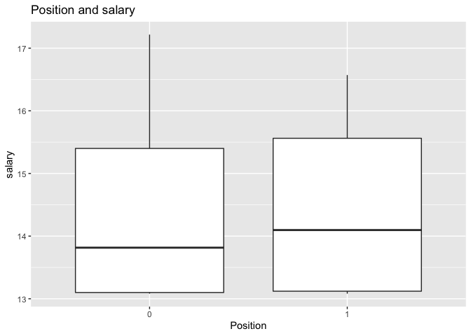

Predict 2012 Baseball Players’ Salaries
================
Yulan Rong
12/10/2019

##### The goal of this project is to predict salaries of baseball players by analyzing data from the 2012 baseball season from Sean Lahmann’s database.

#### Data Exploration and Feature Creation

``` r
load(url("http://www.stat.berkeley.edu/users/nolan/data/baseball2012.rda"))
head(baseball)
```

    ##          ID yearID teamID lgID nameFirst nameLast  salary POS G.x  GS
    ## 1 abreubo01   2012    LAA   AL     Bobby    Abreu 9000000  OF  54  50
    ## 2 abreuto01     NA   <NA> <NA>      <NA>     <NA>      NA  23  21  17
    ## 3 ackledu01   2012    SEA   AL    Dustin   Ackley 2100000  12 153 147
    ## 4 adamsma01     NA   <NA> <NA>      <NA>     <NA>      NA  1B  24  23
    ## 5 allenbr01   2012    OAK   AL   Brandon    Allen  482500  O1   6   5
    ## 6 alonsyo01   2012    SDN   NL    Yonder   Alonso 1400000  1B 149 144
    ##   InnOuts   PO   A  E DP G.y G_batting  AB  R   H X2B X3B HR RBI SB CS BB
    ## 1    1133   70   2  1  1 100        NA 219 29  53  11   1  3  24  6  2 37
    ## 2     482   27  47  1 15  22        NA  70  5  18   2   1  1  15  0  0  2
    ## 3    3953  289 398  8 96 153        NA 607 84 137  22   2 12  50 13  3 59
    ## 4     584  210  12  3 13  27        NA  86  8  21   6   0  2  13  0  0  5
    ## 5     129   29   2  0  1  10        NA  20  3   2   0   0  1   3  0  0  2
    ## 6    3829 1269  96 12 77 155        NA 549 47 150  39   0  9  62  3  0 62
    ##    SO IBB HBP SH SF GIDP years  CAB   CH CHR   CR CRBI  CBB
    ## 1  56   3   0  0  1    7    17 8347 2437 287 1441 1349 1456
    ## 2  13   0   1  0  1    1     4  437  110   4   40   46   16
    ## 3 124   7   0  1  1    3     2  940  228  18  123   86   99
    ## 4  24   0   0  0  0    3     1   86   21   2    8   13    5
    ## 5   9   0   0  0  0    0     4  344   70  12   44   41   42
    ## 6 101   9   3  1  4   14     3  666  185  14   58   80   72

``` r
dim(baseball)
```

    ## [1] 627  40

``` r
dat = baseball[, -(1:6)]
head(dat)
```

    ##    salary POS G.x  GS InnOuts   PO   A  E DP G.y G_batting  AB  R   H X2B
    ## 1 9000000  OF  54  50    1133   70   2  1  1 100        NA 219 29  53  11
    ## 2      NA  23  21  17     482   27  47  1 15  22        NA  70  5  18   2
    ## 3 2100000  12 153 147    3953  289 398  8 96 153        NA 607 84 137  22
    ## 4      NA  1B  24  23     584  210  12  3 13  27        NA  86  8  21   6
    ## 5  482500  O1   6   5     129   29   2  0  1  10        NA  20  3   2   0
    ## 6 1400000  1B 149 144    3829 1269  96 12 77 155        NA 549 47 150  39
    ##   X3B HR RBI SB CS BB  SO IBB HBP SH SF GIDP years  CAB   CH CHR   CR CRBI
    ## 1   1  3  24  6  2 37  56   3   0  0  1    7    17 8347 2437 287 1441 1349
    ## 2   1  1  15  0  0  2  13   0   1  0  1    1     4  437  110   4   40   46
    ## 3   2 12  50 13  3 59 124   7   0  1  1    3     2  940  228  18  123   86
    ## 4   0  2  13  0  0  5  24   0   0  0  0    3     1   86   21   2    8   13
    ## 5   0  1   3  0  0  2   9   0   0  0  0    0     4  344   70  12   44   41
    ## 6   0  9  62  3  0 62 101   9   3  1  4   14     3  666  185  14   58   80
    ##    CBB
    ## 1 1456
    ## 2   16
    ## 3   99
    ## 4    5
    ## 5   42
    ## 6   72

``` r
AVG = dat$H / dat$AB
dat$AVG = AVG
CAVG = dat$CH / dat$CAB
dat$CAVG = CAVG

OBP = 100 * (dat$H + dat$BB) / (dat$AB + dat$BB)
dat$OBP = OBP
COBP = 100 * (dat$CH + dat$CBB) / (dat$CAB + dat$CBB)
dat$COBP = COBP

AB.per = dat$CAB / dat$years
dat$AB.per = AB.per
H.per = dat$CH / dat$years
dat$H.per = H.per
HR.per = dat$CHR / dat$years
dat$HR.per = HR.per
R.per = dat$CR / dat$years
dat$R.per = R.per
RBI.per = dat$CRBI / dat$years
dat$RBI.per = RBI.per

dat$POS[dat$POS == '2B'| baseball$POS == 'SS' | 
          baseball$POS == 'C'|baseball$POS == 'CF'] = 1
dat$POS[dat$POS != 1] = 0
dat$POS = as.factor(dat$POS)

dat$threetofive = factor(ifelse(
  (dat$years >= 3 & dat$years <= 5), 1, 0))
dat$oversix = factor(ifelse((dat$years >= 6), 1, 0))

dat$salary = log(dat$salary)
dat$CAB = log(dat$CAB)

dat$G_batting = NULL

dat = dat[!is.na(dat$salary),]

pairs(~salary + years + CHR +CAVG + CR + COBP + CAB +CH, data = dat)
```

<!-- -->

``` r
ggplot(dat, aes(x = POS, y = salary)) + geom_boxplot() + 
  labs(title = "Position and salary", x = 'Position', y = 'salary')
```

<!-- -->

``` r
ggplot(dat, aes(x = CAB, y = salary)) + geom_point() + 
  labs(title = "CAB and salary", x = 'CAB', y = 'salary')
```

<!-- -->

``` r
ggplot(dat, aes(x = COBP, y = salary)) + geom_point() + 
  labs(title = "career on-base percentage and salary", 
       x = 'career on-base percentage', y = 'salary')
```

<!-- -->

#### Data Analysis

##### 1\. Fit a simple model to predict salaries.

``` r
dat$log.CR = log(dat$CR + 1)

simpleModel = lm(salary ~ threetofive + oversix + log.CR + 
                   oversix:log.CR + threetofive:log.CR,, data = dat)
summary(simpleModel)
```

    ## 
    ## Call:
    ## lm(formula = salary ~ threetofive + oversix + log.CR + oversix:log.CR + 
    ##     threetofive:log.CR, data = dat)
    ## 
    ## Residuals:
    ##      Min       1Q   Median       3Q      Max 
    ## -2.86728 -0.31778 -0.05134  0.37901  2.75941 
    ## 
    ## Coefficients:
    ##                     Estimate Std. Error t value Pr(>|t|)    
    ## (Intercept)         12.88064    0.34241  37.617  < 2e-16 ***
    ## threetofive1        -1.06871    0.48652  -2.197   0.0286 *  
    ## oversix1            -3.96431    0.53493  -7.411 7.10e-13 ***
    ## log.CR               0.08743    0.09318   0.938   0.3486    
    ## oversix1:log.CR      0.94036    0.11511   8.169 3.78e-15 ***
    ## threetofive1:log.CR  0.24940    0.11878   2.100   0.0364 *  
    ## ---
    ## Signif. codes:  0 '***' 0.001 '**' 0.01 '*' 0.05 '.' 0.1 ' ' 1
    ## 
    ## Residual standard error: 0.6914 on 415 degrees of freedom
    ## Multiple R-squared:  0.7008, Adjusted R-squared:  0.6971 
    ## F-statistic: 194.4 on 5 and 415 DF,  p-value: < 2.2e-16

``` r
plot(simpleModel$fitted.values, simpleModel$residuals, xlab = "fitted values", ylab = "residuals")
abline(h = 0, col = 'red')
```

<!-- -->

``` r
# we can see the variance of the residual is not constant since 
# when fitted value increases, residuals spread out.

qqnorm(simpleModel$residuals)
qqline(simpleModel$residuals)
```

<!-- -->

``` r
# from the residual qq plot we can see that the points on the left side
# are not on the line. So the residuals are not enough normally
# distributed. this model is not perfect.  
```

##### 2.check for outliers, leverage and influential observation.

``` r
# check for leverage.
leveragePlots(simpleModel)
```

<!-- -->

``` r
X <- matrix(c(rep(1,421),dat$log.CR, 
              dat$threetofive, dat$oversix),421,4) 
H <- X %*% solve(t(X) %*% X) %*% t(X)
h = diag(H)
# according to Fox, A rough cutoff for noteworthy 
# hat-values is hi > 2h_hat = 2(k+1)/n.
h.mean <- (4+1)/nrow(dat)
# check if there's leverage point that exceed twice of the h. 
sortedh <- sort(h, decreasing=TRUE, index.return=TRUE) 
unusual <- sortedh$ix[sortedh$x > 2*h.mean]
ggplot(dat,aes(x = log.CR, y = salary)) +
geom_point() + geom_point(data = dat[unusual,], aes(x = log.CR, y = salary), color = "red") + labs (x = "log career run", y = "log salary", title = "Leverage in red")
```

<!-- -->

``` r
# check for outliers
outlierTest(simpleModel) 
```

    ##      rstudent unadjusted p-value Bonferroni p
    ## 599 -4.273113         2.3942e-05     0.010080
    ## 100  4.124243         4.4969e-05     0.018932

``` r
# the outlier of this model is row 500 and row 100
qqPlot(simpleModel, main = "QQ Plot")
```

<!-- -->

    ## 100 599 
    ##  72 398

``` r
S_E2=sum(simpleModel$residuals^2)/(nrow(dat)-4-1)
standE=simpleModel$residuals/(sqrt(S_E2)*sqrt(1-h))
# the studentized residuals for all the points.
studE=standE*sqrt((421 - 4 -2)/(421-4-1-standE^2))
abs_studE = abs(studE)
a = dat
a$abs_studE = abs_studE
# 6 observations with the largest absolute values of the studentized residuals:
head(a[order(-abs_studE),]) 
```

    ##       salary POS G.x  GS InnOuts  PO   A E DP G.y  AB  R   H X2B X3B HR
    ## 599 13.52783   0  55  37    1063  58 103 3 19  60 153 13  36   5   1  0
    ## 100 16.01274   0 104 102    2702 221   9 3  0 129 487 70 142  25   5 23
    ## 458 13.59237   0 107  98    2399 156   1 1  0 130 394 59 121  10   6  1
    ## 572 14.03865   0   4   4      81  35   2 1  4  58 163 17  41   7   0  8
    ## 205 13.81551   0  13  12     269  86   3 0  7  60  89  7  20   4   0  1
    ## 277 13.91082   0  93  76    1953 131   2 0  0 130 384 50  92  19   3 19
    ##     RBI SB CS BB  SO IBB HBP SH SF GIDP years      CAB   CH CHR   CR CRBI
    ## 599   7  3  2  7  17   0   0  1  2    5    24 9.267288 2877  80 1445  951
    ## 100  82 16  4 43 102   5   7  0  3    9     1 6.188264  142  23   70   82
    ## 458  25 37  7 23  27   0   4 17  1    4    13 8.884195 2141  17 1039  509
    ## 572  25  0  0 22  61   3   1  0  0    6    22 9.038603 2328 612 1583 1699
    ## 205   8  0  0 20  24   2   2  0  2    4    18 8.856661 1968 429 1203 1405
    ## 277  62  3  0 35  67   5   4  0  2   14    17 8.820404 1883 271  978 1116
    ##      CBB       AVG      CAVG      OBP     COBP   AB.per    H.per    HR.per
    ## 599 1028 0.2352941 0.2717740 26.87500 33.62321 441.0833 119.8750  3.333333
    ## 100   43 0.2915811 0.2915811 34.90566 34.90566 487.0000 142.0000 23.000000
    ## 458  451 0.3071066 0.2966607 34.53237 33.80282 555.1538 164.6923  1.307692
    ## 572 1747 0.2515337 0.2764189 34.05405 40.07277 382.8182 105.8182 27.818182
    ## 205 1334 0.2247191 0.2803020 36.69725 39.52124 390.0556 109.3333 23.833333
    ## 277  638 0.2395833 0.2780978 30.31026 34.02618 398.2941 110.7647 15.941176
    ##        R.per  RBI.per threetofive oversix   log.CR abs_studE
    ## 599 60.20833 39.62500           0       1 7.276556  4.259267
    ## 100 70.00000 82.00000           0       0 4.262680  4.112949
    ## 458 79.92308 39.15385           0       1 6.946976  3.634079
    ## 572 71.95455 77.22727           0       1 7.367709  3.620117
    ## 205 66.83333 78.05556           0       1 7.093405  3.525795
    ## 277 57.52941 65.64706           0       1 6.886532  3.058261

``` r
# when p =0.05, t-test= 1.649, so set +-1.649 as bounds of outliers.
sorted_studE <- sort(abs_studE, decreasing=TRUE, index.return=TRUE)
unusual_stud <- sorted_studE$ix[sorted_studE$x < -1.649 
                                | sorted_studE$x > 1.649]
ggplot(data = dat, aes(x = log.CR, y = salary),) + geom_point() + geom_point(data = dat[unusual_stud,], aes(x = log.CR, y = salary), color = "red") + labs (x = "log career run", y = "log salary", title = "outlier in red")
```

<!-- -->

``` r
# H0: it's not an outlier.
Emax=max(abs_studE)
# Hypothesis test without Bonferroni correction:
p1=1-pt(Emax,421-4-2)
p1
```

    ## [1] 1.269742e-05

``` r
# Hypothesis test with Bonferroni correction:
ptrue=2*421*p1
ptrue
```

    ## [1] 0.01069123

``` r
# since ptrue is less than 0.05, so outliers exist.

# check influential observation
dis = cooks.distance(simpleModel)
temp = dat
temp$distance = dis
# 6 observations that have largest values of Cook's distance.
head(temp[order(-dis),])
```

    ##       salary POS G.x  GS InnOuts  PO   A E DP G.y  AB  R   H X2B X3B HR
    ## 100 16.01274   0 104 102    2702 221   9 3  0 129 487 70 142  25   5 23
    ## 619 13.14608   0   1   0       0   0   0 0  0  78   2  0   0   0   0  0
    ## 599 13.52783   0  55  37    1063  58 103 3 19  60 153 13  36   5   1  0
    ## 572 14.03865   0   4   4      81  35   2 1  4  58 163 17  41   7   0  8
    ## 205 13.81551   0  13  12     269  86   3 0  7  60  89  7  20   4   0  1
    ## 3   14.55745   0 153 147    3953 289 398 8 96 153 607 84 137  22   2 12
    ##     RBI SB CS BB  SO IBB HBP SH SF GIDP years      CAB   CH CHR   CR CRBI
    ## 100  82 16  4 43 102   5   7  0  3    9     1 6.188264  142  23   70   82
    ## 619   0  0  0  0   2   0   0  1  0    0     5 2.708050    1   0    2    0
    ## 599   7  3  2  7  17   0   0  1  2    5    24 9.267288 2877  80 1445  951
    ## 572  25  0  0 22  61   3   1  0  0    6    22 9.038603 2328 612 1583 1699
    ## 205   8  0  0 20  24   2   2  0  2    4    18 8.856661 1968 429 1203 1405
    ## 3    50 13  3 59 124   7   0  1  1    3     2 6.845880  228  18  123   86
    ##      CBB       AVG       CAVG      OBP      COBP   AB.per    H.per
    ## 100   43 0.2915811 0.29158111 34.90566 34.905660 487.0000 142.0000
    ## 619    0 0.0000000 0.06666667  0.00000  6.666667   3.0000   0.2000
    ## 599 1028 0.2352941 0.27177404 26.87500 33.623213 441.0833 119.8750
    ## 572 1747 0.2515337 0.27641890 34.05405 40.072770 382.8182 105.8182
    ## 205 1334 0.2247191 0.28030195 36.69725 39.521245 390.0556 109.3333
    ## 3     99 0.2257002 0.24255319 29.42943 31.472570 470.0000 114.0000
    ##        HR.per    R.per  RBI.per threetofive oversix   log.CR   distance
    ## 100 23.000000 70.00000 82.00000           0       0 4.262680 0.07684213
    ## 619  0.000000  0.40000  0.00000           1       0 1.098612 0.06625383
    ## 599  3.333333 60.20833 39.62500           0       1 7.276556 0.05632603
    ## 572 27.818182 71.95455 77.22727           0       1 7.367709 0.04618585
    ## 205 23.833333 66.83333 78.05556           0       1 7.093405 0.03064628
    ## 3    9.000000 61.50000 43.00000           0       0 4.820282 0.02889839

``` r
sortedCook = sort(dis, decreasing = TRUE, index.return = TRUE)
criterion = 4/(421-4-1)
influntial = sortedCook$ix[sortedCook$x > criterion]
ggplot(data = dat, aes(x = log.CR, y = salary)) + geom_point() + geom_point(data = dat[influntial,], aes(x = log.CR, y = salary), color = "red") + labs (x = "log career run", y = "log salary", title = "influential in red")
```

<!-- -->

##### 3 Fit a linear least-squares regression model

``` r
test = lm(salary~.,data = dat)
summary(test)
```

    ## 
    ## Call:
    ## lm(formula = salary ~ ., data = dat)
    ## 
    ## Residuals:
    ##     Min      1Q  Median      3Q     Max 
    ## -1.7127 -0.3132  0.0157  0.3193  1.9078 
    ## 
    ## Coefficients:
    ##                Estimate Std. Error t value Pr(>|t|)    
    ## (Intercept)   1.435e+01  9.545e-01  15.039  < 2e-16 ***
    ## POS1          4.548e-02  8.338e-02   0.545 0.585797    
    ## G.x           2.564e-03  4.583e-03   0.559 0.576187    
    ## GS           -6.680e-03  1.085e-02  -0.616 0.538485    
    ## InnOuts       2.305e-04  4.791e-04   0.481 0.630684    
    ## PO            8.263e-05  2.355e-04   0.351 0.725851    
    ## A             2.508e-04  7.463e-04   0.336 0.736967    
    ## E             2.310e-03  1.041e-02   0.222 0.824517    
    ## DP           -2.692e-03  2.189e-03  -1.230 0.219639    
    ## G.y          -1.166e-02  3.409e-03  -3.421 0.000691 ***
    ## AB            6.714e-03  1.802e-03   3.726 0.000225 ***
    ## R            -9.922e-03  6.281e-03  -1.580 0.115016    
    ## H            -8.820e-03  5.691e-03  -1.550 0.122028    
    ## X2B          -7.041e-03  6.906e-03  -1.020 0.308586    
    ## X3B           3.707e-03  1.817e-02   0.204 0.838497    
    ## HR           -1.219e-02  1.200e-02  -1.016 0.310481    
    ## RBI           6.240e-03  5.754e-03   1.084 0.278887    
    ## SB           -2.688e-03  5.813e-03  -0.462 0.644008    
    ## CS           -2.103e-02  1.830e-02  -1.149 0.251273    
    ## BB            5.846e-03  4.574e-03   1.278 0.202062    
    ## SO           -1.559e-03  1.907e-03  -0.817 0.414419    
    ## IBB           9.628e-03  1.353e-02   0.712 0.476988    
    ## HBP           5.619e-03  1.085e-02   0.518 0.604774    
    ## SH            4.701e-03  1.596e-02   0.295 0.768472    
    ## SF            2.695e-03  2.014e-02   0.134 0.893641    
    ## GIDP         -1.043e-02  9.207e-03  -1.132 0.258172    
    ## years        -1.174e-01  3.590e-02  -3.271 0.001170 ** 
    ## CAB          -1.834e-01  3.292e-01  -0.557 0.577816    
    ## CH            2.777e-03  1.025e-03   2.709 0.007067 ** 
    ## CHR           6.275e-03  3.799e-03   1.652 0.099379 .  
    ## CR           -2.533e-03  1.661e-03  -1.525 0.128044    
    ## CRBI         -2.053e-03  1.827e-03  -1.123 0.262055    
    ## CBB          -7.084e-04  5.798e-04  -1.222 0.222584    
    ## AVG           3.287e-01  2.624e+00   0.125 0.900369    
    ## CAVG         -9.078e-01  3.964e+00  -0.229 0.818980    
    ## OBP           1.039e-02  2.254e-02   0.461 0.645025    
    ## COBP         -4.134e-02  3.214e-02  -1.286 0.199198    
    ## AB.per       -7.686e-03  2.961e-03  -2.596 0.009802 ** 
    ## H.per        -6.017e-03  1.435e-02  -0.419 0.675307    
    ## HR.per       -5.982e-02  3.605e-02  -1.659 0.097875 .  
    ## R.per         4.756e-02  1.696e-02   2.805 0.005293 ** 
    ## RBI.per       4.057e-02  1.663e-02   2.439 0.015173 *  
    ## threetofive1  9.084e-02  1.315e-01   0.691 0.490251    
    ## oversix1      1.396e+00  1.920e-01   7.271 2.09e-12 ***
    ## log.CR        3.080e-01  3.247e-01   0.949 0.343367    
    ## ---
    ## Signif. codes:  0 '***' 0.001 '**' 0.01 '*' 0.05 '.' 0.1 ' ' 1
    ## 
    ## Residual standard error: 0.5726 on 376 degrees of freedom
    ## Multiple R-squared:  0.814,  Adjusted R-squared:  0.7923 
    ## F-statistic: 37.41 on 44 and 376 DF,  p-value: < 2.2e-16

``` r
# from the Pr(>|t|), I drop the variables with high Pr.
todrop = c("CR", "POS", "AVG", "SF", "X3B", "PO", "CAB", "E", "A", "SH", "OBP", "H.per")
dat1 = dat[, !(names(dat) %in% todrop)]
fullmod = lm(salary~., data = dat1)
summary(fullmod)
```

    ## 
    ## Call:
    ## lm(formula = salary ~ ., data = dat1)
    ## 
    ## Residuals:
    ##      Min       1Q   Median       3Q      Max 
    ## -1.70399 -0.32574  0.02589  0.33910  1.88270 
    ## 
    ## Coefficients:
    ##                Estimate Std. Error t value Pr(>|t|)    
    ## (Intercept)  13.8326186  0.3874959  35.697  < 2e-16 ***
    ## G.x           0.0009278  0.0042836   0.217 0.828630    
    ## GS           -0.0065100  0.0106814  -0.609 0.542570    
    ## InnOuts       0.0003222  0.0004602   0.700 0.484211    
    ## DP           -0.0018078  0.0011083  -1.631 0.103676    
    ## G.y          -0.0100315  0.0031358  -3.199 0.001493 ** 
    ## AB            0.0052622  0.0015133   3.477 0.000564 ***
    ## R            -0.0088538  0.0060464  -1.464 0.143922    
    ## H            -0.0054381  0.0044954  -1.210 0.227128    
    ## X2B          -0.0083902  0.0066493  -1.262 0.207771    
    ## HR           -0.0131779  0.0114664  -1.149 0.251152    
    ## RBI           0.0068585  0.0051977   1.320 0.187773    
    ## SB           -0.0031542  0.0055854  -0.565 0.572585    
    ## CS           -0.0202806  0.0176714  -1.148 0.251820    
    ## BB            0.0070914  0.0037409   1.896 0.058749 .  
    ## SO           -0.0020393  0.0017707  -1.152 0.250162    
    ## IBB           0.0089996  0.0128964   0.698 0.485695    
    ## HBP           0.0055919  0.0104583   0.535 0.593174    
    ## GIDP         -0.0102122  0.0088062  -1.160 0.246902    
    ## years        -0.1239879  0.0345584  -3.588 0.000376 ***
    ## CH            0.0014133  0.0004419   3.198 0.001495 ** 
    ## CHR           0.0037464  0.0032160   1.165 0.244772    
    ## CRBI         -0.0010675  0.0016086  -0.664 0.507323    
    ## CBB          -0.0012003  0.0004793  -2.504 0.012686 *  
    ## CAVG         -1.4933275  2.8033734  -0.533 0.594553    
    ## COBP         -0.0259863  0.0273136  -0.951 0.341992    
    ## AB.per       -0.0070511  0.0014938  -4.720 3.30e-06 ***
    ## HR.per       -0.0417875  0.0299985  -1.393 0.164421    
    ## R.per         0.0334009  0.0081754   4.086 5.35e-05 ***
    ## RBI.per       0.0326036  0.0142327   2.291 0.022514 *  
    ## threetofive1  0.0576722  0.1201801   0.480 0.631582    
    ## oversix1      1.3622919  0.1722248   7.910 2.71e-14 ***
    ## log.CR        0.1906512  0.1314202   1.451 0.147672    
    ## ---
    ## Signif. codes:  0 '***' 0.001 '**' 0.01 '*' 0.05 '.' 0.1 ' ' 1
    ## 
    ## Residual standard error: 0.5675 on 388 degrees of freedom
    ## Multiple R-squared:  0.8115, Adjusted R-squared:  0.796 
    ## F-statistic:  52.2 on 32 and 388 DF,  p-value: < 2.2e-16

##### 4 Find 10 best models using regsubsets.

``` r
bestfit = regsubsets(salary~., data = dat1, method = "forward", nvmax = 33, nbest = 10)
bestfitsum = summary(bestfit)
plot(bestfitsum$adjr2, xlab = "number of variables", ylab = "adjusted R squared")
```

<!-- -->

``` r
plot(bestfitsum$rss, xlab = "number of variables", ylab = "RSS")
```

<!-- -->

``` r
plot(bestfitsum$bic, xlab = "number of variables", ylab = "BIC")
```

<!-- -->

``` r
plot(bestfit, scale = "bic")
```

<!-- -->

##### 5 Find 5 best models using BIC

``` r
bic = bestfitsum$bic
bic = sort(bic, decreasing = FALSE, index.return = TRUE)
best5 = head(bic$ix, 5)
# best 5 variable model for each is different
coef(bestfit, best5)
```

    ## [[1]]
    ##  (Intercept)           GS          G.y        years           CH 
    ## 13.733378190  0.006129758 -0.004282587 -0.153545777  0.001167940 
    ##         COBP       AB.per        R.per      RBI.per     oversix1 
    ## -0.034719046 -0.004581100  0.016287817  0.020637551  1.397216192 
    ##       log.CR 
    ##  0.203738484 
    ## 
    ## [[2]]
    ##   (Intercept)            GS           G.y         years            CH 
    ## 13.1018173492  0.0057123771 -0.0039981206 -0.1039806770  0.0011849310 
    ##           CBB        AB.per         R.per       RBI.per      oversix1 
    ## -0.0007983729 -0.0045949789  0.0205167566  0.0217429640  1.3871793654 
    ##        log.CR 
    ##  0.0412577106 
    ## 
    ## [[3]]
    ##  (Intercept)           GS          G.y        years           CH 
    ## 13.098954504  0.006210352 -0.004238586 -0.121753648  0.001033035 
    ##       AB.per        R.per      RBI.per     oversix1       log.CR 
    ## -0.003588515  0.014443660  0.018910918  1.431191942  0.051984988 
    ## 
    ## [[4]]
    ##   (Intercept)            GS         years            CH           CBB 
    ## 13.0474419021  0.0025712113 -0.0954867095  0.0011553490 -0.0008473514 
    ##        AB.per         R.per       RBI.per      oversix1        log.CR 
    ## -0.0046490969  0.0222286539  0.0212475132  1.3980504868  0.0091015501 
    ## 
    ## [[5]]
    ##  (Intercept)           GS          G.y           AB        years 
    ## 13.782739514  0.003857828 -0.007381366  0.001456294 -0.146751880 
    ##           CH         COBP       AB.per        R.per      RBI.per 
    ##  0.001128705 -0.035607115 -0.004740652  0.016149466  0.020261921 
    ##     oversix1       log.CR 
    ##  1.373812112  0.214019954

##### 6 Cross validation

``` r
set.seed(200)
permutation <- sample(1:nrow(dat1))
folds <- c(rep(1:10, each = nrow(dat1)/10), 10) 
X <- model.matrix(salary ~ ., dat1)
avg_test_MSE <- rep(0,5)
for(i in 1:5){
  test_MSE <- rep(0,10)
  for(j in 1:10){
    idx_train <- permutation[folds != j]
    idx_test <- permutation[folds == j]
    vars <- bestfitsum$which[best5[i],]
    X_best_subset <- X[,vars]
    mod <- lm(dat1$salary ~ X_best_subset - 1, subset = idx_train) 
    X_test <- X_best_subset[idx_test,]
    test_predictions <- X_test %*% as.matrix(coef(mod))
    test_MSE[j] <- mean((dat1$salary[idx_test] - test_predictions)^2)
  }
  avg_test_MSE[i] <- mean(test_MSE) 
}

plot(sqrt(avg_test_MSE), xlab = "Model Ranking in BIC", ylab = "Root Mean Squared Error", pch = 20, cex = 2)
```

<!-- -->

``` r
avg_test_MSE
```

    ## [1] 0.3503448 0.3519214 0.3574891 0.3540284 0.3493218

``` r
which.min(avg_test_MSE)
```

    ## [1] 5

``` r
# from the 10 folds cross validation, model 5 has the lowesr average 
# test MSE among the 5 best models. 
```

##### 7 LASSO model

``` r
X = model.matrix(salary~., dat1)[, -1]
y = dat1$salary
lambda.grid = 10^seq(10, -2, length = 100)
lasso.mod = glmnet(x = X, y = y, alpha = 1)
cv.lasso.mod = cv.glmnet(x = X, y = y, alpha = 1, nfolds = 10)

plot(cv.lasso.mod)
```

<!-- -->

``` r
# the best（suitable) lasso lambda, which has the min lambda:
best.lasso.lam = cv.lasso.mod$lambda.min
best.lasso.lam 
```

    ## [1] 0.002033664

``` r
# this best lasso lambda minimizes the mean squared error. 


plot(lasso.mod, xvar = "lambda")
lines(c(log(best.lasso.lam), log(best.lasso.lam)), c(-1000, 1000), lty = "dashed", lwd = 3)
```

<!-- -->

``` r
best.lasso.coefs <- predict(lasso.mod, type = 'coefficients', s = best.lasso.lam)

# the non zero coefficients:
best.lasso.coefs
```

    ## 33 x 1 sparse Matrix of class "dgCMatrix"
    ##                          1
    ## (Intercept)   1.366980e+01
    ## G.x           4.097775e-04
    ## GS            .           
    ## InnOuts       1.076215e-04
    ## DP           -1.341209e-03
    ## G.y          -7.707510e-03
    ## AB            2.774665e-03
    ## R            -4.475705e-03
    ## H            -1.342135e-03
    ## X2B          -7.570267e-03
    ## HR           -1.537411e-02
    ## RBI           5.602878e-03
    ## SB           -1.787898e-03
    ## CS           -1.927809e-02
    ## BB            5.912868e-03
    ## SO           -1.026808e-03
    ## IBB           7.531025e-03
    ## HBP           3.598134e-03
    ## GIDP         -4.357005e-03
    ## years        -1.046266e-01
    ## CH            1.056729e-03
    ## CHR           1.007927e-03
    ## CRBI          7.385905e-05
    ## CBB          -9.683927e-04
    ## CAVG         -9.411223e-01
    ## COBP         -1.878871e-02
    ## AB.per       -4.304255e-03
    ## HR.per       -3.822925e-05
    ## R.per         2.462918e-02
    ## RBI.per       1.531116e-02
    ## threetofive1  7.233433e-02
    ## oversix1      1.409022e+00
    ## log.CR        8.946796e-02

``` r
# except GS, others have non zero coefficients, 
# but many of them's coefficients are close to zero.
```

##### 8 Conclusion

``` r
min(cv.lasso.mod$cvm)
```

    ## [1] 0.3640886

``` r
avg_test_MSE
```

    ## [1] 0.3503448 0.3519214 0.3574891 0.3540284 0.3493218

``` r
min(avg_test_MSE)
```

    ## [1] 0.3493218

``` r
# by comparing the CV MSE from step 6 and LASSO, LASSO has higher 
# average MSE than the best 5 models' average Test MSE, so using 
# BIC method for choosing the best model is better than using LASSO.
# Thus, the best model in BIC method, which is model 5 will have a  
# good performance to predict this dataset.


coef(bestfit, best5)[[5]] # best model among others above.
```

    ##  (Intercept)           GS          G.y           AB        years 
    ## 13.782739514  0.003857828 -0.007381366  0.001456294 -0.146751880 
    ##           CH         COBP       AB.per        R.per      RBI.per 
    ##  0.001128705 -0.035607115 -0.004740652  0.016149466  0.020261921 
    ##     oversix1       log.CR 
    ##  1.373812112  0.214019954
